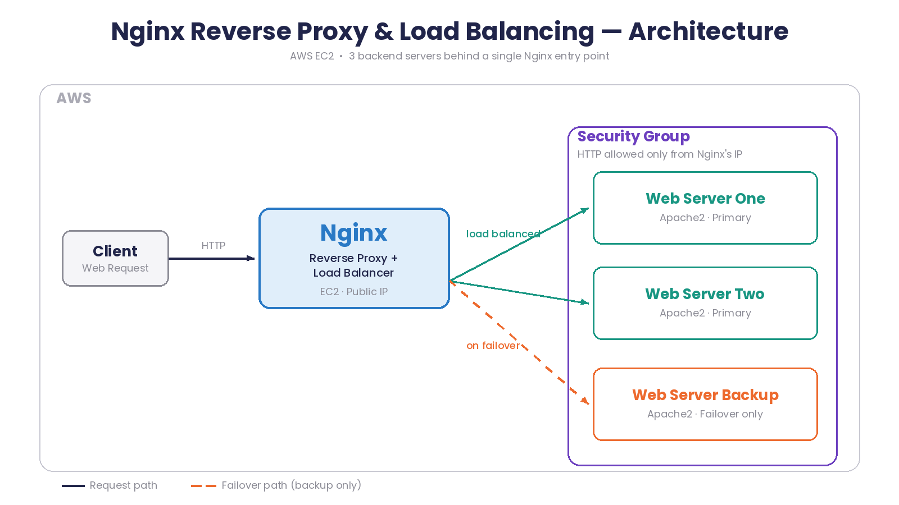
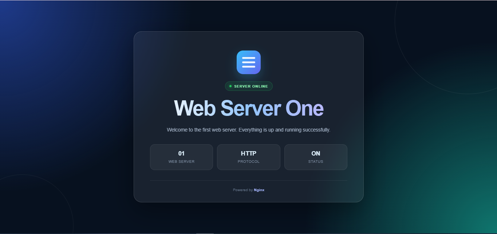
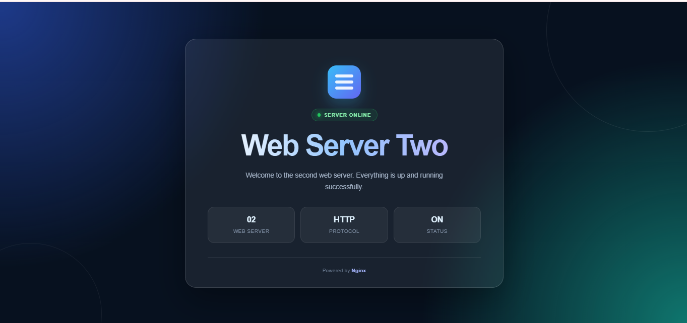
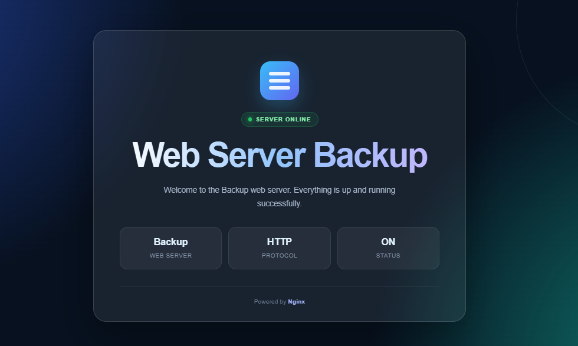

<h1 align="center">⚖️ Nginx Reverse Proxy & Load Balancing on AWS EC2</h1>

<p align="center">
A hands-on setup demonstrating Nginx as a reverse proxy and load balancer distributing traffic across multiple AWS EC2 web servers, with automatic backup server failover.
</p>

<p align="center">
  
</p>

---

## 📌 Overview

This project explores two core Nginx concepts hands-on:

- **Reverse proxying** — forwarding incoming web requests through Nginx instead of exposing backend servers directly, which improves security.
- **Load balancing** — distributing incoming traffic across multiple servers instead of overloading one, with a backup server that only kicks in if the primary servers go down.

## 🏗️ Architecture

| Instance | Role | Web Server |
|---|---|---|
| **Nginx Instance** | Reverse proxy / Load balancer (entry point) | Nginx |
| **Web Server One** | Primary backend #1 | Apache2 |
| **Web Server Two** | Primary backend #2 | Apache2 |
| **Web Server Backup** | Failover backend (activates only if One & Two are down) | Apache2 |

**Flow:** Request → Nginx (public IP) → routed to Web One / Web Two (load-balanced) → falls back to Web Backup if both are unreachable.

## 🛠️ Tech Stack

- **Nginx** — reverse proxy & load balancer
- **Apache2** — backend web servers
- **AWS EC2** — hosting for all 4 instances
- **AWS Security Groups** — HTTP access control between instances
- **HTML/CSS** — simple one-page site served by each backend

## ⚙️ Setup Steps

1. Built a simple one-page site with HTML & CSS.
2. Launched an EC2 instance, installed and configured **Nginx**, and confirmed the site ran through it.
3. Launched a second EC2 instance, installed **Apache2**, deployed the site, and updated the heading to `Web Server One`.
4. Repeated step 3 for two more EC2 instances — `Web Server Two` and `Web Server Backup`.
5. On the Nginx instance, defined all three backend servers under an `upstream` block in `nginx.conf` to enable load balancing and failover.
6. Updated each backend instance's **Security Group** to allow HTTP traffic from the Nginx server's public IP, so requests only reach them through the proxy.
7. Verified load balancing by hitting the Nginx public IP repeatedly, then tested failover by stopping Web One & Web Two — traffic automatically shifted to Web Backup.

## 📝 Sample `nginx.conf`

```nginx
events{}
http {
    upstream backend{
        server 34.229.84.**:80;
        server 44.222.212.1**:80;
        server 34.207.143.2**:80 backup;   # only used if the above are down
    }

    server {
        listen 80;

        location / {
            proxy_pass http://backend/;
        }
    }
}
```


## 💡 What I Learned

- How Nginx works as a **reverse proxy**, and why hiding backend servers behind it improves security.
- How the `upstream` directive enables **load balancing** across multiple servers.
- How the `backup` parameter creates automatic **failover** behavior.
- How to scope **AWS Security Groups** so backend servers only accept traffic from the proxy, not the open internet.

## 🖼️ Screenshots

<p align="center">
  
  
  
</p>


<p align="center"><em>Web Server One · Web Server Two · Web Server Backup</em></p>


## 🤔 Open Question

Still learning — if you have suggestions on making this setup more production-ready (health checks, SSL termination at Nginx, auto-scaling instead of a fixed backup instance), I'd really appreciate the advice.